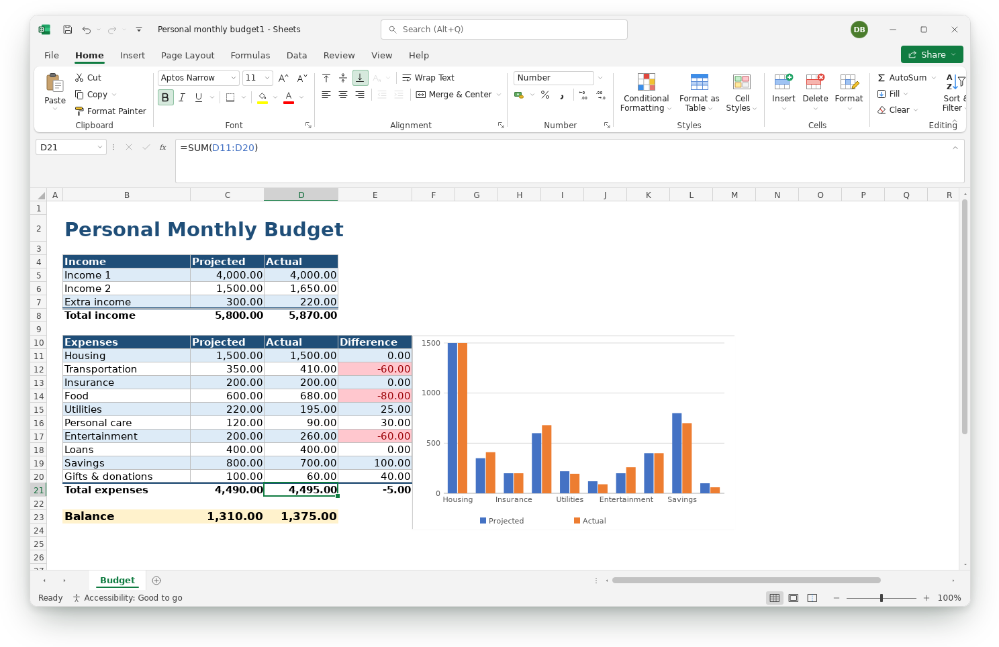
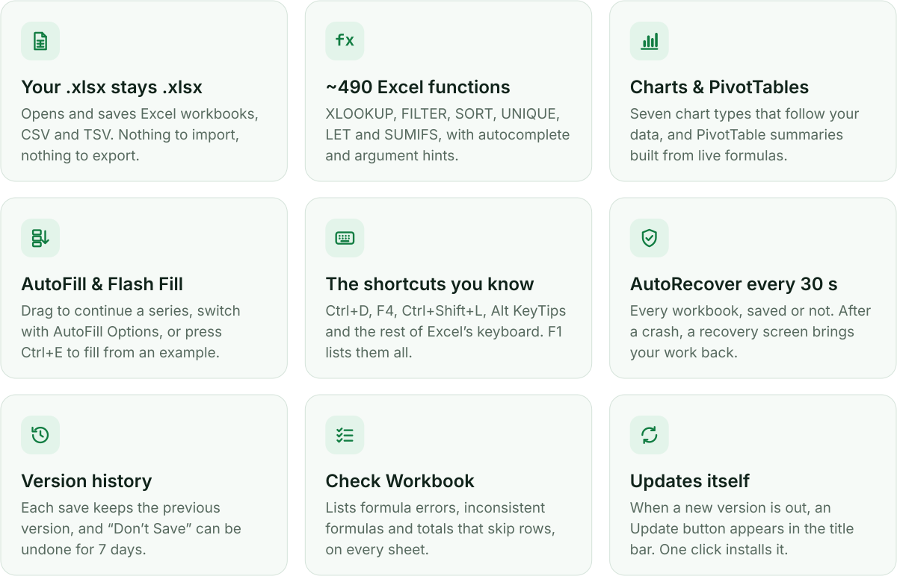
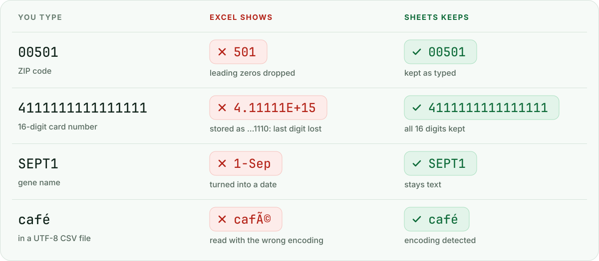
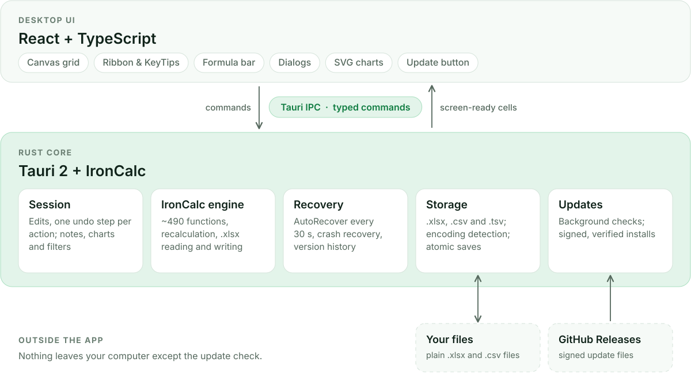

<p align="center">
  
</p>

<p align="center">
  <a href="https://github.com/Dipendra-creator/sheets-desktop/releases/latest"></a>
  <a href="https://github.com/Dipendra-creator/sheets-desktop/releases"></a>
  <a href="https://github.com/Dipendra-creator/sheets-desktop/actions/workflows/ci.yml"></a>
  <a href="LICENSE"></a>
  
</p>

<p align="center">
  <a href="#download"><b>Download</b></a> &nbsp;·&nbsp;
  <a href="#meet-sheets">Introduction</a> &nbsp;·&nbsp;
  <a href="#features">Features</a> &nbsp;·&nbsp;
  <a href="#why-sheets">Why Sheets</a> &nbsp;·&nbsp;
  <a href="#build-from-source">Build</a> &nbsp;·&nbsp;
  <a href="docs/ROADMAP.md">Roadmap</a> &nbsp;·&nbsp;
  <a href="CHANGELOG.md">Changelog</a>
</p>

## Meet Sheets

**Sheets is a free desktop spreadsheet for Windows and macOS that opens and saves Excel `.xlsx` files.**
It has the tools you already know (a ribbon, the formula bar, ~490 Excel functions, charts,
PivotTables, AutoFill and Excel's keyboard shortcuts) in a download of about 4 MB instead of
gigabytes. No subscription, no account, no telemetry.

It's built around one promise: **a spreadsheet must never silently change or lose your data.**
Sheets keeps leading zeros, long IDs and gene names exactly as you typed them, saves your work
every 30 seconds (even a workbook you never saved), and keeps the previous version every time you
save.

**Made for**

- 🎓 **Students**: a real spreadsheet without a subscription, light enough for any laptop.
- 🏪 **Small businesses**: invoices, budgets and stock lists in the `.xlsx` files your accountant already uses.
- 📊 **Analysts**: the shortcuts, KeyTips, XLOOKUP, Paste Special and Flash Fill your hands already know.
- 🔬 **Researchers**: sample IDs, accession numbers and gene names that stay exactly as typed.
- 🍎 **Mac users**: the same app, files and shortcuts (with ⌘) as your Windows colleagues.

Sheets is written in Rust ([Tauri 2](https://tauri.app) and the
[IronCalc](https://github.com/ironcalc/IronCalc) engine) with a React/TypeScript interface, and
it's open source under the [MIT License](LICENSE).

<p align="center">
  
</p>

## Download

<p align="center">
  <a href="https://github.com/Dipendra-creator/sheets-desktop/releases/latest"></a>
  &nbsp;
  <a href="https://github.com/Dipendra-creator/sheets-desktop/releases/latest"></a>
</p>

Both buttons open the [latest release](https://github.com/Dipendra-creator/sheets-desktop/releases/latest).
Pick the file for your computer:

| Platform | File to download |
| --- | --- |
| **Windows 10/11** (64-bit) | `Sheets_<version>_x64-setup.exe`: the installer (recommended, no admin rights needed) |
| | `Sheets_<version>_x64_en-US.msi`: for IT deployment (Intune, Group Policy) |
| | `Sheets_<version>_x64-portable.exe`: a single file, nothing to install |
| **macOS, Apple Silicon** (M1/M2/M3/M4) | `Sheets_<version>_aarch64.dmg` |
| **macOS, Intel** | `Sheets_<version>_x64.dmg` |

<details>
<summary><b>First launch</b>: the builds aren't code-signed yet</summary>
<br>

- **Windows**: if SmartScreen says "Windows protected your PC", click **More info → Run anyway**.
- **macOS**: drag Sheets to Applications, then the first time **right-click → Open → Open**.
  If macOS reports the app as damaged, run `xattr -dr com.apple.quarantine /Applications/Sheets.app`.

</details>

**Updates:** from version 0.4.0, Sheets tells you when a new version is out. An **Update
available** button appears in the title bar; click it, then **Restart to update**. Workbooks with
unsaved changes are kept and offered again after the restart. (Help → Check for Updates; turn
automatic checks off in Options. The portable `.exe` never installs anything: it shows the update
and links to the new portable file.) Coming from 0.3.0 or earlier? Install the latest version once
from the Releases page.

## Features

<picture>
  <source media="(prefers-color-scheme: dark)" srcset="docs/assets/features-dark.svg">
  
</picture>

<details>
<summary><b>Everything Sheets can do</b></summary>
<br>

- **Files**: open and save `.xlsx`/`.xlsm`, `.csv`, `.tsv`/`.txt`; templates; recent and pinned
  files; drag and drop to open; opening a file while Sheets runs reuses the running app.
- **Safety**: AutoRecover and Document Recovery, Recover Unsaved Workbooks, version history,
  crash-safe atomic saves, data-integrity guards (Options → *Data integrity*).
- **Editing**: in-cell and formula-bar editing, point mode with coloured references, function
  autocomplete and argument hints, F4 absolute references, Format Painter, Find & Replace, Go To,
  unlimited undo/redo, AutoComplete and Alt+↓ pick lists.
- **AutoFill**: the fill handle works like Excel's. Drag, Ctrl+drag or double-click it, then use
  the **AutoFill Options** button to switch between Copy Cells, Fill Series, Formatting Only,
  Without Formatting and Fill Days / Weekdays / Months / Years. Numbers, dates, `Item 1`, `1st`,
  `Q1`, month and day names continue as series; Home → Fill → Series… sets step, stop and trend;
  **Flash Fill** (Ctrl+E) fills a column from an example.
- **Paste Special**: formulas, values, formats, column widths, Add/Subtract/Multiply/Divide,
  Skip blanks, Transpose and Paste Link (Ctrl+Alt+V); Ctrl+Shift+V pastes values.
- **Formatting**: fonts, colours, borders, alignment, wrap, merge, number formats with live
  preview, cell styles, Format as Table, conditional formatting (rules, data bars, colour scales,
  icon sets).
- **Formulas**: ~490 Excel functions including dynamic arrays (`FILTER`, `SORT`, `UNIQUE`,
  `SEQUENCE`), `XLOOKUP` and `LET`; Name Manager; Show Formulas; **Check Workbook**.
- **Data**: sort (quick and multi-level), **AutoFilter**, Remove Duplicates, **Text to Columns**,
  **PivotTable** summaries built from live `SUMIFS`/`COUNTIFS` formulas.
- **Charts**: column, bar, line, area, pie, doughnut and scatter. They update with the data, skip
  filtered rows, can be moved and resized, and are saved inside the `.xlsx`.
- **Review**: cell notes (Excel comments are imported), links (Ctrl+click to open), workbook
  statistics.
- **View & print**: freeze panes, zoom, gridlines and headings, command search (Alt+Q),
  Print / Save as PDF with orientation, fit to width, gridlines and headings, multiple windows.
- **Updates**: background checks, signed downloads verified before installing, and a one-click
  restart that keeps unsaved workbooks.
- **Platforms**: Windows 10/11 and macOS 10.15+ (Apple Silicon and Intel), with native window
  controls and ⌘ shortcuts on the Mac.

</details>

<details>
<summary><b>Handy keyboard shortcuts</b></summary>
<br>

| | Windows | macOS |
| --- | --- | --- |
| KeyTips (ribbon by keyboard) | Alt or F10 | ⌥ or F10 |
| Flash Fill | Ctrl+E | ⌘E |
| Fill down / right | Ctrl+D / Ctrl+R | ⌘D / ⌘R |
| Paste Special / values only | Ctrl+Alt+V / Ctrl+Shift+V | ⌥⌘V / ⇧⌘V |
| Repeat last action | F4 or Ctrl+Y | F4 or ⌘Y |
| Select data region, then sheet | Ctrl+A | ⌘A |
| Pick from the column's entries | Alt+↓ | ⌥↓ |
| Filter on/off | Ctrl+Shift+L | ⇧⌘L |
| Insert chart | Alt+F1 | ⌥F1 |
| New / edit note | Shift+F2 | ⇧F2 |
| Insert link | Ctrl+K | ⌘K |
| Open link in cell | Ctrl+click | ⌘+click |
| Print / PDF | Ctrl+P | ⌘P |
| Search commands | Alt+Q | ⌥Q |

Excel's keyboard shortcuts work too: press **F1** (or Help → Keyboard Shortcuts) for the
searchable list.

</details>

## Why Sheets?

Excel's best-known failures are silent: data changed on import, work lost in a crash, a formula
range that stops one row short. Sheets fixes these by default.

<picture>
  <source media="(prefers-color-scheme: dark)" srcset="docs/assets/integrity-dark.svg">
  
</picture>

| Problem in Excel | What Sheets does |
| --- | --- |
| `00501` becomes `501`; the card number `4111111111111111` becomes `4.11111E+15` and is stored as `4111111111111110` | Leading zeros and numbers longer than 15 digits are kept exactly: typed, pasted or imported |
| Gene names such as `SEPT1` / `MARCH1` turn into dates (27 human genes were renamed because of this) | Only complete dates are converted |
| AutoRecover every 10 minutes, and only for files saved at least once | AutoRecover 30 s after every change, for every workbook, with a recovery screen after a crash |
| "Don't Save" is final | Unsaved workbooks are kept for 7 days |
| No local version history | Every save keeps the previous version (File → Info) |
| CSV files open with garbled accents; "Save as CSV" rounds numbers to their display format | UTF-8/UTF-16/Windows-1252 detection; CSV saved as UTF-8 with BOM and full precision |
| 100-step undo, cleared by macros | Unlimited undo; big actions are one step |
| Formula mistakes are small green triangles (the Reinhart–Rogoff and "London Whale" errors) | **Review → Check Workbook** lists errors, inconsistent formulas and totals that skip numbers across every sheet |
| 4 GB (Windows) / 10 GB (macOS) of disk space and a subscription | ≈ 4 MB installer (≈ 5 MB on a Mac), ≈ 12 MB installed; free, no account, no telemetry |

Details and sources: **[docs/EXCEL_PAIN_POINTS.md](docs/EXCEL_PAIN_POINTS.md)**.

## Roadmap

Planned next: data validation, notes and charts that Excel can display, page setup, formula
auditing arrows, refreshable PivotTables, Linux packages, code-signed installers and co-authoring.
See **[docs/ROADMAP.md](docs/ROADMAP.md)** for the full Excel feature-parity matrix and release
plan, and [CHANGELOG.md](CHANGELOG.md) for what changed in each version.

## Build from source

Prerequisites: Rust (stable), Node 20+, pnpm 10.
Windows needs WebView2 (preinstalled on Windows 10/11); Linux needs
`libwebkit2gtk-4.1-dev` (see the [Tauri prerequisites](https://tauri.app/start/prerequisites/)).

```bash
pnpm install
pnpm tauri dev          # development with hot reload
pnpm tauri build        # release build + installers in src-tauri/target/release/bundle
```

Tests:

```bash
cd src-tauri
cargo test --lib                                                     # engine, storage, recovery, features
cargo test --release --lib perf_large_sheet -- --ignored --nocapture  # performance smoke test
cd .. && pnpm typecheck                                              # TypeScript
```

The README images are built by [`docs/assets/build.py`](docs/assets/build.py)
(`pip install fonttools uharfbuzz`, with the Inter and JetBrains Mono fonts installed).

<details>
<summary><b>Releasing</b> (maintainers)</summary>
<br>

1. Bump the version in `src-tauri/tauri.conf.json`, `src-tauri/Cargo.toml` and `package.json`,
   and add a section to `CHANGELOG.md`.
2. Push (or merge) the change to `main`. Pushing a matching tag (`git tag v0.3.0 && git push origin v0.3.0`)
   or running the **Release** workflow from the Actions tab works too.
3. [`.github/workflows/release.yml`](.github/workflows/release.yml) sees that this version has no
   release yet, builds Windows (installer, MSI, portable) and macOS (Apple Silicon and Intel DMGs)
   in parallel, uploads them to a draft release with the notes from
   [`.github/release-notes.md`](.github/release-notes.md), and publishes it (creating the `vX.Y.Z`
   tag) when every build has succeeded. Pushes that don't change the version don't release anything.

**In-app updates** need the update-signing key as repository secrets (Settings → Secrets and
variables → Actions): `TAURI_SIGNING_PRIVATE_KEY` (the private key file's contents) and, if the
key has a password, `TAURI_SIGNING_PRIVATE_KEY_PASSWORD`. The matching public key is
`plugins.updater.pubkey` in `src-tauri/tauri.conf.json`. With the secret set, each release gets
signed update files and a `latest.json`, and installed copies update themselves. Without it the
build stops with an error and the release stays a draft: add the secret and re-run the **Release**
workflow (a repository variable `ALLOW_UNSIGNED_RELEASE` = `true` builds an unsigned release
anyway, which the app only announces). Keep the private key safe: if it is lost,
generate a new pair (`pnpm tauri signer generate -w ~/.tauri/sheets.key`), put the new public
key in `tauri.conf.json`, and users install that release once by hand.

</details>

## Architecture

<picture>
  <source media="(prefers-color-scheme: dark)" srcset="docs/assets/architecture-dark.svg">
  
</picture>

- **Rust owns the data.** The UI keeps only a cache of the visible cells. Every edit is a
  command; the backend returns `WorkbookInfo` and the UI refetches just the visible window.
- **Canvas grid.** Virtualised rendering with frozen panes, merges, text overflow, wrap,
  borders, data bars/icons, filter buttons and note markers, drawn in device pixels.
- **One undo step per user action.** `Session` groups engine operations and snapshots the
  extras (merges, notes, charts, filters) that IronCalc does not track.
- **Everything in one file.** Notes, charts and filter criteria are stored as JSON in a
  *very hidden* worksheet, the standard way add-ins keep private data in a workbook. Excel
  preserves it without showing it; Sheets strips it on load and re-creates it on save.
- **Extension points** for a future database layer: `storage::WorkbookStore`,
  `templates::TemplateProvider`, `sync::SyncBackend` (every edit already produces an IronCalc
  diff batch for live sync).

<details>
<summary><b>Source tree</b></summary>
<br>

```
src-tauri/src
├── engine/          Session = one open workbook on top of IronCalc's UserModel
│   ├── session.rs     edits, styles, merges, sort, find/replace, clipboard, grouped undo/redo
│   ├── session/features.rs  notes, charts, AutoFilter, Text to Columns, PivotTable, health check
│   ├── extras.rs      merges, notes, charts, filters: shifted on row/column edits, part of undo
│   ├── meta.rs        stores extras in a very hidden sheet inside the .xlsx
│   ├── input.rs       Excel-like typed input (dates, times, currency) + literal protection
│   ├── dto.rs         screen-ready DTOs (Excel pixels, resolved colours, style tables)
│   └── merges.rs, styling.rs
├── recovery.rs      AutoRecover snapshots, crash recovery, unsaved workbooks, version history
├── updates.rs       in-app updates: background checks, signed download/install, GitHub fallback
├── storage/         WorkbookStore trait + FileStore (.xlsx, .csv/.tsv), encoding detection, atomic saves
├── templates/       TemplateProvider trait + built-in templates
├── sync/            SyncBackend trait (change stream hook) + LocalOnly default
├── commands/        Tauri IPC surface (thin wrappers)
└── state.rs         sessions, windows, clipboard, settings, AutoRecover pass

src
├── api/             typed wrappers for every command (the only place that calls invoke)
├── workbook/        WorkbookController, canvas grid renderer, ribbon, formula bar, dialogs,
│   ├── charts/        SVG chart renderer + interactive chart layer
│   ├── FilterMenu.tsx, NotesLayer.tsx, print.ts
├── backstage/       start screen / File menu (recovery, versions, print)
├── components/      icons, menus, popups, dialogs, colour picker
└── lib/             A1 helpers, formula tokenizer, function catalogue, formats, platform
```

</details>

## Known limitations

- Charts and notes are saved in the `.xlsx` and restored by Sheets, but Excel does not display
  them yet (planned: native Excel charts and comments).
- Not yet available: pictures and shapes, data validation, sheet protection, page margins and
  headers/footers, formula auditing arrows, spell check, indent and text rotation.
- `.xls` (legacy binary) files are not supported; save them as `.xlsx` in Excel first.
- `.xlsm` workbooks open normally, but macros are neither run nor kept. Sheets never overwrites
  the original: saving writes a copy as `.xlsx`.
- IronCalc recalculates the whole workbook after each edit: instant for typical sheets,
  ~150 ms for 500k filled cells. Fraction number formats render incorrectly in this
  IronCalc version.
- Builds are not code-signed or notarized yet (see *Download*).

## Feedback and contributing

Try Sheets with one of your real files and say what's missing:
[open an issue](https://github.com/Dipendra-creator/sheets-desktop/issues). Bug reports that come
with a sample file are the easiest to fix. Pull requests are welcome; run the tests above before
sending one.

## License

Sheets is free and open source under the [MIT License](LICENSE): you may use, copy, modify and
share it, including commercially, as long as the copyright and licence notice stay with it.

Excel and Microsoft 365 are trademarks of Microsoft Corporation. Sheets is an independent project
and is not affiliated with, endorsed by or sponsored by Microsoft.

<p align="center">
  <sub>Built with Rust, Tauri 2, IronCalc and React.</sub>
</p>
